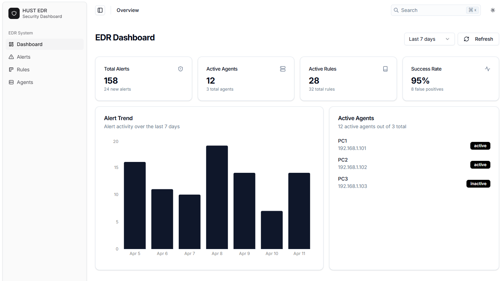
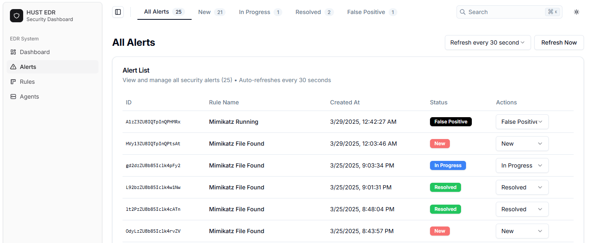
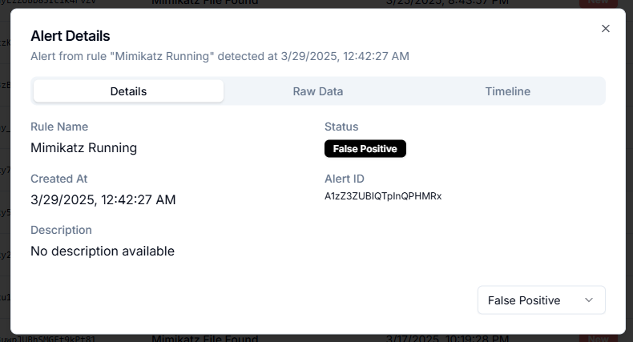
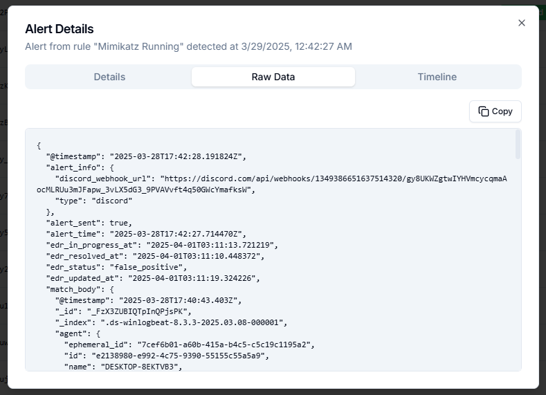
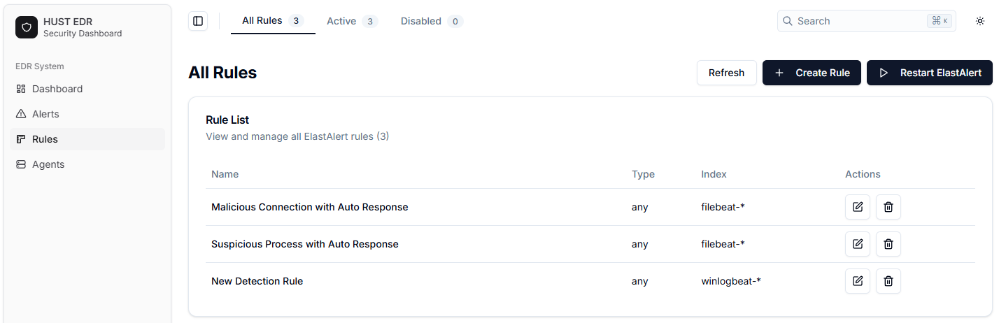
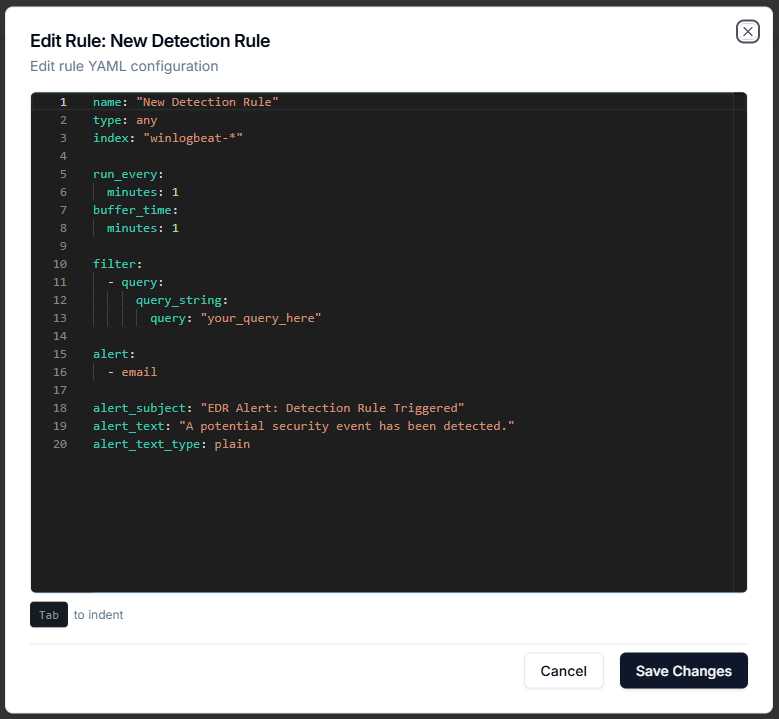
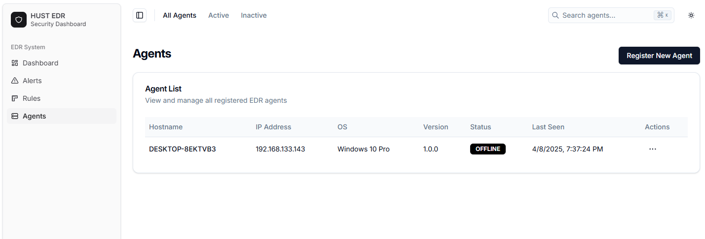
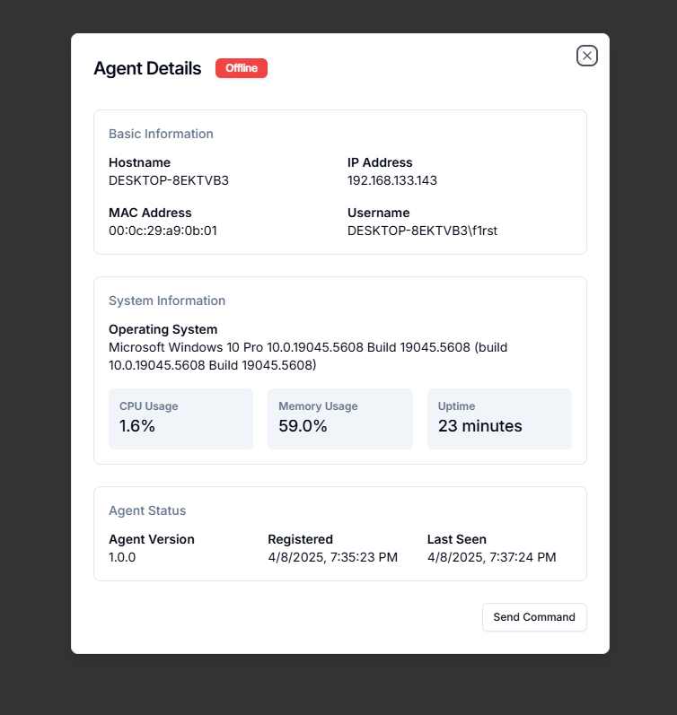
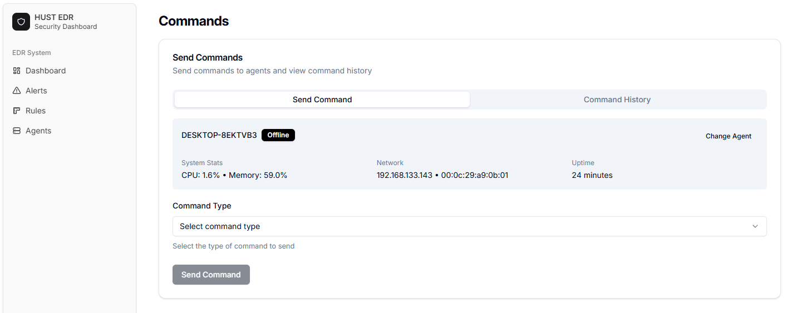

# Hust EDR Dashboard

Modern, responsive dashboard UI for the Hust Endpoint Detection and Response (EDR) system.

## Original Author

Crafted with 🤍 by [@satnaing](https://github.com/satnaing)

Edited by [@f1rst](https://github.com/phannhat17)

## License

Licensed under the [MIT License](https://github.com/satnaing/shadcn-admin/blob/main/LICENSE)

## Tech Stack

- **UI:** [ShadcnUI](https://ui.shadcn.com) (TailwindCSS + RadixUI)

- **Build Tool:** [Vite](https://vitejs.dev/)

- **Routing:** [TanStack Router](https://tanstack.com/router/latest)

- **Type Checking:** [TypeScript](https://www.typescriptlang.org/)

- **Linting/Formatting:** [Eslint](https://eslint.org/) & [Prettier](https://prettier.io/)

- **Icons:** [Tabler Icons](https://tabler.io/icons)

## Getting Started

### Demo image

> All data in the image is sample data.

1. Overview Dashboard



2. Alert 








3. Rule 





3. Agent










### Prerequisites

- Node.js 16+ 
- pnpm (recommended) or npm

## Project Structure

```
frontend/
├── public/           # Static assets
├── src/              # Source code
│   ├── components/   # Reusable UI components
│   ├── features/     # Feature-specific components
│   ├── routes/       # Application routes
│   ├── stores/       # Zustand stores for state management
│   ├── hooks/        # Custom React hooks
│   ├── lib/          # Utility libraries
│   ├── context/      # React contexts
│   ├── types/        # TypeScript type definitions
│   └── utils/        # Helper functions
└── ...               # Configuration files
```